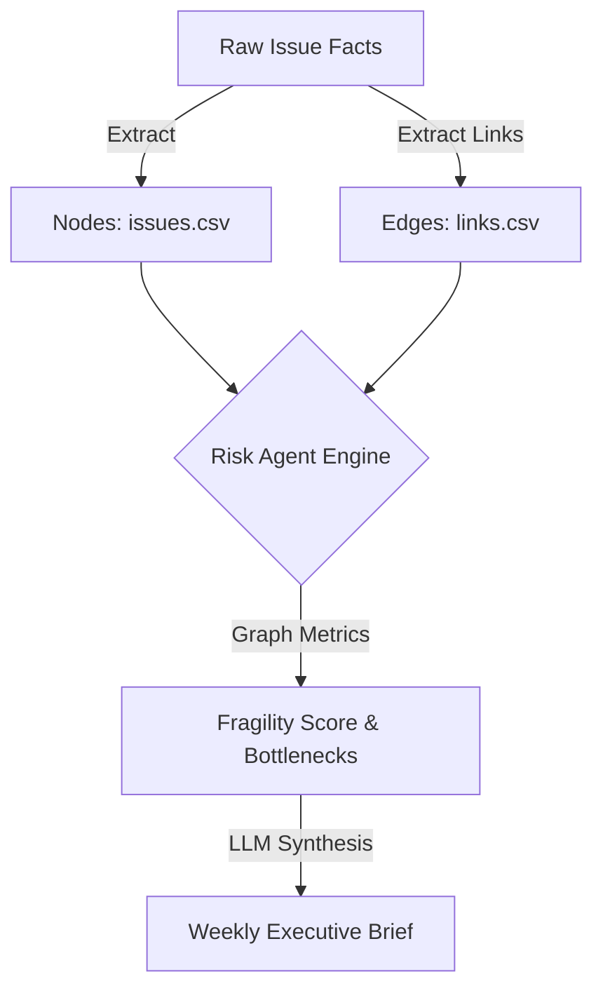

# Network-Based Predictive Risk Agent

An advanced AI Agent for detecting rework clusters, cascading dependencies, and structural instability in large-scale software delivery portfolios.

Unlike basic PM tools that simply count overdue tasks or calculate naive EVM, this agent treats project delivery as a **directed graph**. It analyzes issue links (e.g., Jira `issuelinks`) to identify critical path fragilities, defect propagation, and scope expansions.

---

## Enterprise PMO Features

This dashboard goes beyond basic issue counting to highlight systemic project fragility:
- **Structural Fragility Detection:** Quantifies the true risk of an issue based on how deeply it's embedded in the dependency graph.
- **Rework Clusters:** Identifies quality bottlenecks where issues are constantly split, cloned, or dumped into buckets.
- **Dependency Bottleneck Detection:** Calculates downstream impact sizes (e.g., "Downstream impact: 12 tasks") using NetworkX depth mapping.
- **Predictive Schedule Slip Identification:** Penalizes closed issues (0.3x) to naturally bubble up open, high-risk critical path blockers.
- **Automated Executive Summaries:** Generates a real-time weekly AI risk brief identifying the top delay and rework warnings with concrete recommendations.
- **Evidence-Based Risk Reasoning:** Explains *why* a node is high-risk in plain English (e.g., "Blocks Others: 8 | Duplicated: 2").
- **Visual Severity & Trends:** Scannable severity badges (🔴 High Risk, 🟠 Medium Risk) and simulated vector trends (⬆️ Getting worse).

## Pipeline Architecture

- `generate_synthetic_data.py`: A Python simulator that outputs realistic project facts (`issues.csv`) and relational graphs (`links.csv`) mapped to custom distributions.
- `config.yaml`: Externalized threshold limits and weights for risk factors.
- `sample_risk_brief.md`: Output artifact demonstrating the executive-level summary the LLM generates using the compiled graph heuristics.

## How to Run

1. Generate the synthetic dataset replicating a complex Software Delivery environment:
   ```bash
   python generate_synthetic_data.py
   ```
2. The outputs `issues.csv` and `links.csv` will be produced, detailing over 1000 tasks and their relational graphs.
3. Plug these datasets into your preferred graph analysis tool (NetworkX, Neo4j, or DuckDB) to apply the risk heuristics detailed in `config.yaml`.

## Data Pipeline Architecture


